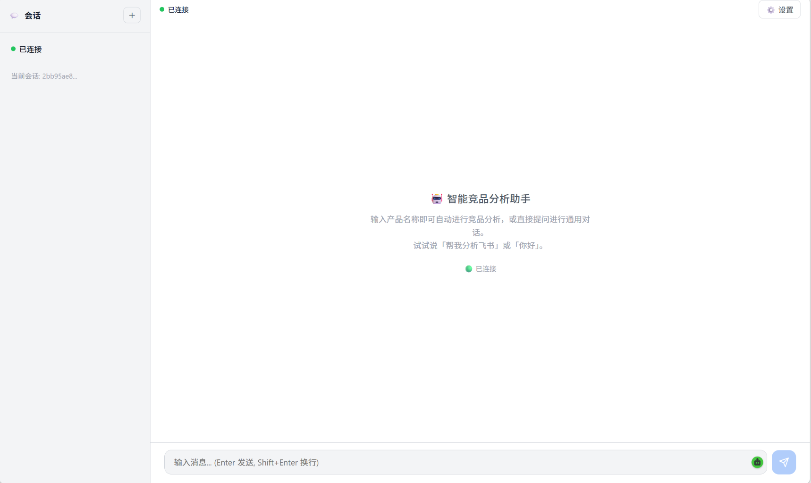
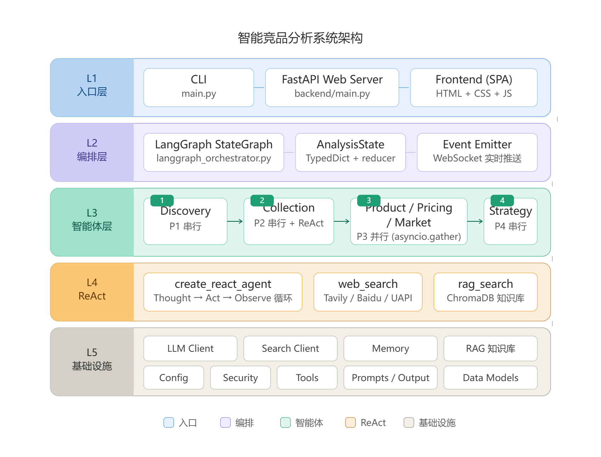
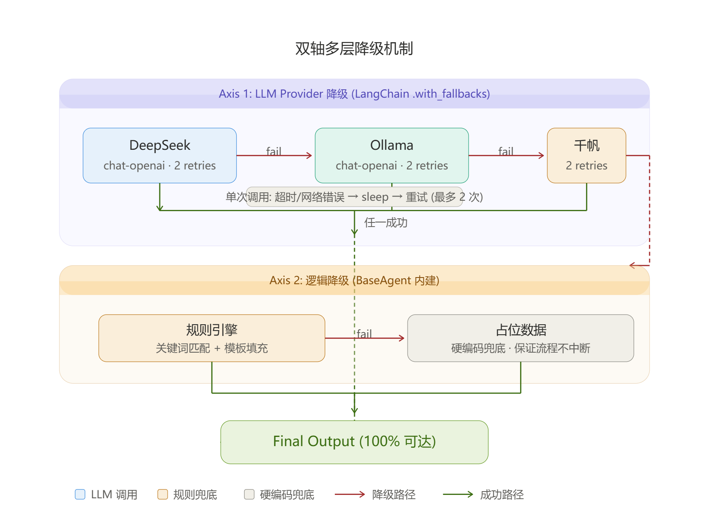
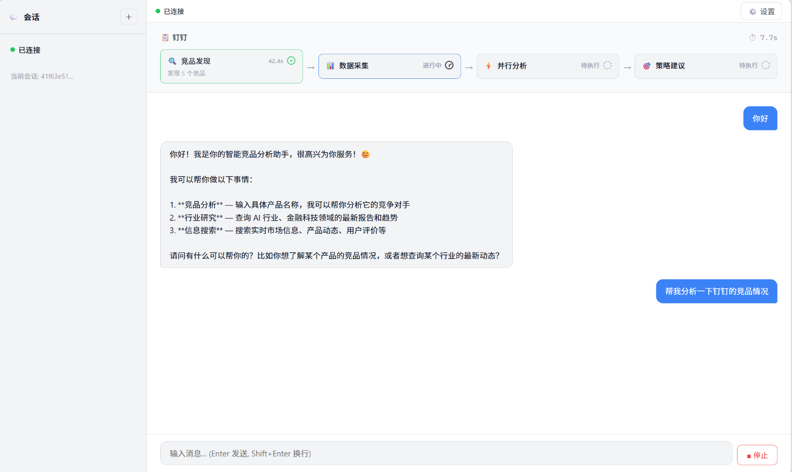
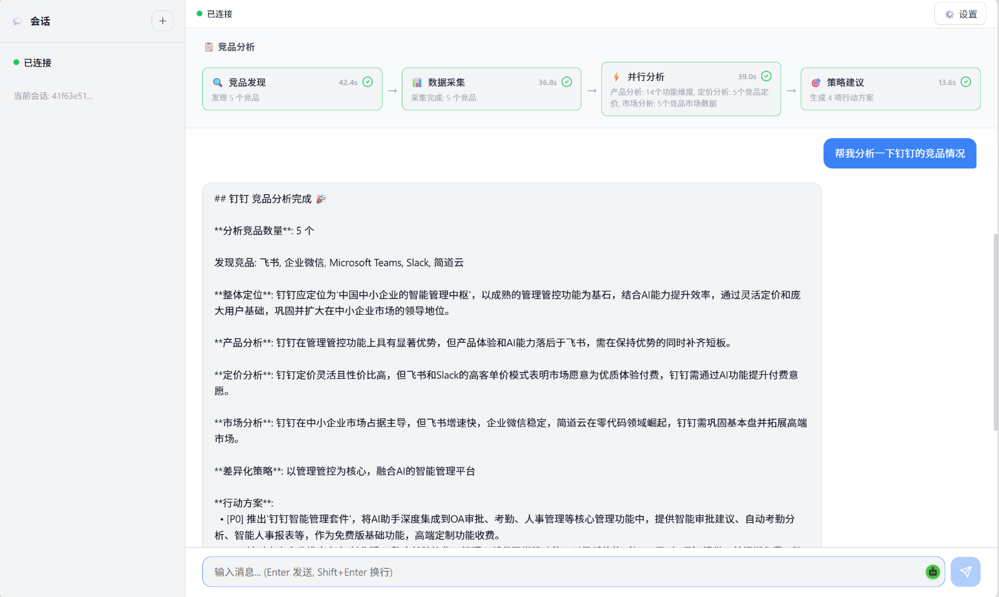
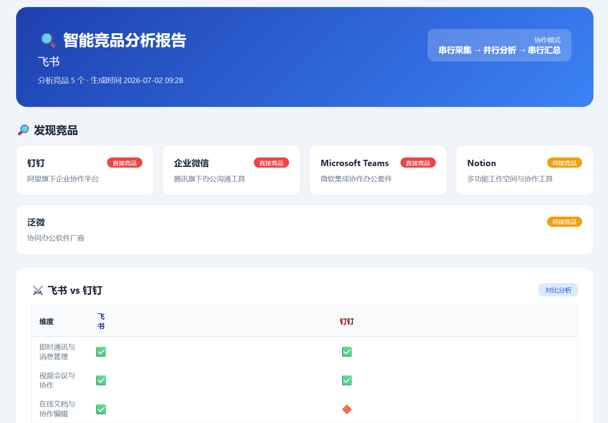
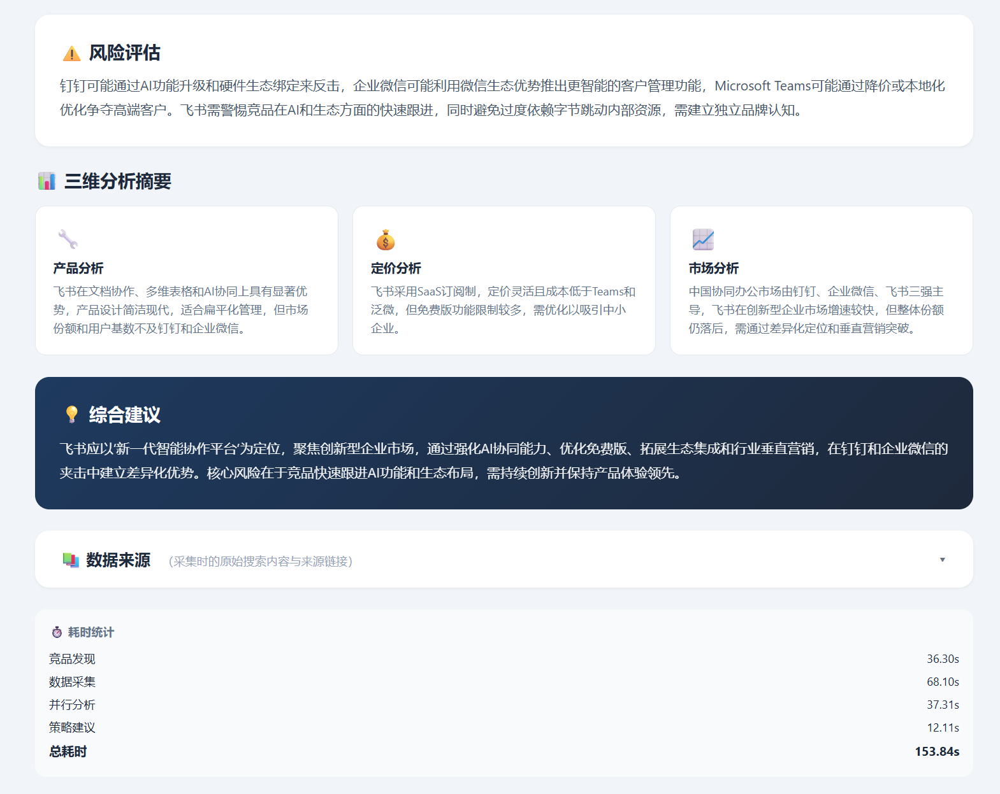

# 智能竞品分析多智能体系统 (Competitor Analysis MAS)

[](https://www.python.org/)
[](https://github.com/langchain-ai/langgraph)
[](https://fastapi.tiangolo.com/)
[](https://react.dev/)
[](LICENSE)

基于 **LangGraph 编排** 的多智能体竞品分析系统。输入一个产品名称，系统自动完成竞品发现、数据采集、三维并行分析（产品/定价/市场）和策略建议，输出 HTML + JSON 格式的专业分析报告。同时提供交互式对话助手，支持多轮对话、网络搜索和 RAG 知识库检索。


*系统主界面 — 左侧会话栏、右侧对话区、底部输入框*

## 系统架构


*整体系统架构 — ConversationalAgent 路由 → LangGraph DAG 编排 → 六 Agent 协同工作*

- **串行采集**：竞品发现 → 逐竞品数据采集（ReAct 自主决策），保证信息深度
- **并行分析**：产品 / 定价 / 市场三维度 `asyncio.gather` 并行，总耗时 ≈ 单路
- **串行汇总**：三维分析报告汇聚后一次性传递给策略 Agent，保证建议的系统性

## 核心特性

- **6 个专业 Agent**：竞品发现、数据采集、产品分析、定价分析、市场分析、策略建议
- **ReAct 自主决策**：数据采集 Agent 基于 LangGraph `create_react_agent` 进行「思考—行动—观察」循环
- **多级降级保障**：LLM 层（Provider + Logic 双轴降级）和搜索层（Tavily → UAPI → 百度）各自独立降级，每层都有规则引擎兜底


*LLM 与搜索双轴降级链路 — 每层都有规则引擎作为最终兜底，确保零 API 依赖下系统仍可运行*
- **RAG 知识库**：将行业 PDF 报告向量化存储（ChromaDB），语义检索增强回答质量
- **长期记忆**：三层架构（deque 滑动窗口 + SQLite 精确检索 + ChromaDB 语义搜索），跨会话持久化对话历史
- **Prompt Injection 防护**：三层安全机制（正则检测 → 调用层拦截 → LLM 行为约束），覆盖 10 类攻击场景，70 项测试通过率 98.6%
- **Web 界面**：React 19 + TypeScript 前端 + FastAPI 后端 + WebSocket 实时通信
- **工作流可视化**：实时展示分析管道的四阶段进度（竞品发现 → 数据采集 → 并行分析 → 策略建议），支持 ReAct 推理过程展开查看
- **规则引擎模式**：零 API 依赖也可运行完整分析流程，适合教学演示和开发测试


## 快速开始

### 环境要求

- Python 3.10+
- Node.js 20+（Web 前端）

### 安装

```bash
# 安装 Python 依赖
cd competitor-analysis-mas-v2
pip install -r requirements.txt
```

### 配置

在项目根目录创建 `.env` 文件（参考 `.env` 示例）：

```env
# LLM 后端（三选一）
LLM_PROVIDER=deepseek                    # deepseek | qianfan | ollama
DEEPSEEK_API_KEY=sk-your-key             # DeepSeek 推荐，性价比高

# 搜索后端（三选一）
SEARCH_PROVIDER=tavily                   # tavily | uapi | baidu
TAVILY_API_KEY=tvly-your-key
```

### 运行

```bash
# 交互式对话模式（推荐）
python main.py --chat

# 单次竞品分析（LLM 模式）
python main.py "飞书"

# 规则引擎模式（零依赖，无需 API Key）
python main.py --rule "飞书"

# 使用本地 Ollama
python main.py --ollama "飞书"

# 指定竞品数量
python main.py --count 5 "飞书"

# 启动 Web 服务（生产模式，前后端一体）
python -m backend.main
# 访问 http://127.0.0.1:8000

# 启动 Web 服务（开发模式，前后端分离）
python -m backend.main               # 后端 API (默认 :8000)
cd web && npm install && npm run dev  # 前端开发服务器 (:5173)
```

### 交互式对话

在 `--chat` 模式下支持以下能力：

| 功能 | 示例 | 说明 |
|------|------|------|
| 竞品分析 | "帮我分析飞书的竞品" | 自动触发完整分析管道 |
| 通用对话 | "钉钉有哪些主要功能？" | 支持网络搜索 + RAG 检索 |
| 历史搜索 | `/search 飞书` | 语义搜索历史分析报告 |
| 清空记忆 | `/clear` | 清空当前会话上下文 |
| 退出 | `exit` / `quit` / `q` | 自动持久化记忆 |


*对话分析示例 — 用户输入产品名称，系统返回含结构化报告的竞品分析结果*

*结构化分析报告 — 含竞品对比、功能矩阵、定价分析和策略建议*

## 项目结构

```
competitor-analysis-mas-v2/
├── main.py                         # 主入口（CLI + 聊天模式）
├── config.py                       # 全局配置（LLM/搜索/安全/Web）
├── requirements.txt                # Python 依赖
├── design.md                       # 详细设计文档（含数据流协议）
│
├── core/                           # 核心引擎（2,532 行）
│   ├── langgraph_orchestrator.py   # LangGraph StateGraph 编排器
│   ├── react_agent.py              # ReAct 自主决策引擎
│   ├── llm_client.py               # LLM 调用封装（三后端 + 双轴降级）
│   ├── search_client.py            # 搜索客户端（三级降级）
│   ├── tools.py                    # ReAct 工具定义（web_search + rag_search）
│   ├── state.py                    # DAG 全局状态类型
│   ├── security.py                 # Prompt Injection 防护
│   ├── memory.py                   # 短期对话记忆
│   └── long_term_memory.py         # 长期记忆（SQLite + ChromaDB）
│
├── agents/                         # Agent 实现（2,370 行）
│   ├── conversational_agent.py     # 对话路由 + 安全检测
│   ├── discovery_agent.py          # 竞品发现
│   ├── collection_agent.py         # 数据采集（ReAct + 降级）
│   ├── product_agent.py            # 产品分析（功能矩阵）
│   ├── pricing_agent.py            # 定价分析
│   ├── market_agent.py             # 市场分析
│   └── strategy_agent.py           # 策略建议
│
├── models/                         # 领域数据模型
│   └── domain.py                   # Pydantic/dataclass 定义
│
├── prompts/                        # Agent 提示词模板 (.md)
│   ├── discovery_agent.md
│   ├── collection_agent.md
│   ├── product_agent.md
│   ├── pricing_agent.md
│   ├── market_agent.md
│   └── strategy_agent.md
│
├── skill/                          # 技能包
│   └── rag_skill/                  # RAG 知识库检索技能
│
├── backend/                        # FastAPI 后端（430 行）
│   ├── main.py                     # API 入口 + 静态文件托管
│   ├── routers/                    # 路由（ws, chat, reports）
│   └── services/                   # 业务服务层（事件总线、会话管理）
│
├── web/                            # React 前端（1,180 行）
│   ├── src/
│   │   ├── components/
│   │   │   ├── Chat/               # 聊天组件（ChatView, ChatInput, MessageBubble, SessionList）
│   │   │   ├── Workflow/           # 工作流可视化（WorkflowTimeline, StageCard, ReactPanel）
│   │   │   ├── Report/             # 报告查看器（ReportViewer）
│   │   │   ├── Settings/           # 设置面板（SettingsPanel）
│   │   │   └── common/             # 通用组件（ErrorBoundary, LoadingSpinner）
│   │   ├── context/AppContext.tsx   # 全局状态管理（useReducer）
│   │   ├── hooks/useWebSocket.ts   # WebSocket 连接管理
│   │   └── styles/globals.css      # 全局样式（暗色/亮色双主题）
│   └── vite.config.ts
│
├── RAG/                            # RAG 知识库管线
│   ├── main.py                     # 索引构建 + 交互检索
│   ├── chunkers/                   # 文本分割器
│   ├── embedding/                  # 向量化模型（BAAI/bge-small-zh-v1.5）
│   └── vector_db/                  # ChromaDB 向量存储
│
├── image/                          # 界面截图
│   ├── image1.png                  # 主界面
│   ├── image2.png                  # 工作流可视化
│   ├── image3.png                  # 对话分析示例
│   ├── image4.png                  # 分析报告详情
│   ├── 系统架构图.png              # 系统架构图
│   └── 系统降级机制图.png          # 降级机制示意图
│
└── output/                         # 分析报告输出
    ├── 飞书_analysis_report.json
    ├── 钉钉_analysis_report.json
    ├── 小红书_analysis_report.json
    ├── 荣耀电脑_analysis_report.json
    └── ... (共 10 份已生成报告)
```


## 技术栈

| 层次 | 技术 |
|------|------|
| 编排引擎 | LangGraph StateGraph (DAG) |
| LLM 后端 | DeepSeek / 百度千帆 / Ollama |
| 搜索后端 | Tavily / UAPI / 百度 AI 搜索 |
| 向量数据库 | ChromaDB |
| 嵌入模型 | BAAI/bge-small-zh-v1.5 |
| 长期记忆 | SQLite + ChromaDB + deque |
| Web 后端 | FastAPI + WebSocket + uvicorn |
| Web 前端 | React 19 + TypeScript + Vite 8 |
| 安全防护 | 正则检测 + LLM 约束 + 权限白名单 |
| 测试 | 70 项注入测试、长期记忆测试、RAG 问答测试 |

## 项目规模

| 类别 | 语言 | 行数 |
|------|------|------|
| 核心引擎 | Python | 2,532 |
| Agent 实现 | Python | 2,370 |
| 后端服务 | Python | 430 |
| CLI + 配置 | Python | 497 |
| 前端界面 | TypeScript/CSS | 1,180 |
| 测试套件 | Python | 1,394 |
| RAG 技能 | Python | 163 |
| **总计** | | **~8,800** |

## 输出报告

分析完成后自动在 `output/` 目录生成两份报告：

- `{产品名}_analysis_report.html` — 可视化 HTML 报告（含功能矩阵、定价对比、市场数据、策略建议）
- `{产品名}_analysis_report.json` — 结构化 JSON 数据


*HTML 报告概览 — 涵盖竞品对比、功能矩阵、定价策略和市场数据*


*报告详情区域 — 展示各竞品的深度分析与差异化策略建议*

## 数据流与 JSON 协议

六个 Agent 之间通过结构化 JSON 传递数据：

**竞品发现 → 竞品列表**
```json
{
  "product_name": "飞书",
  "product_category": "企业协同办公平台",
  "competitors": [
    { "name": "钉钉", "brief": "阿里旗下企业协同平台", "relevance": "HIGH" }
  ]
}
```

**产品分析 → 功能对比矩阵**
```json
{
  "feature_matrix": {
    "features": ["即时通讯", "视频会议", "文档协作", "审批流程"],
    "matrix": {
      "飞书":      ["✅", "✅", "✅", "🔶"],
      "钉钉":      ["✅", "✅", "🔶", "✅"]
    }
  }
}
```

> 完整数据格式参见 [design.md](competitor-analysis-mas-v2/design.md)

## 许可证

[Apache License 2.0](LICENSE)
